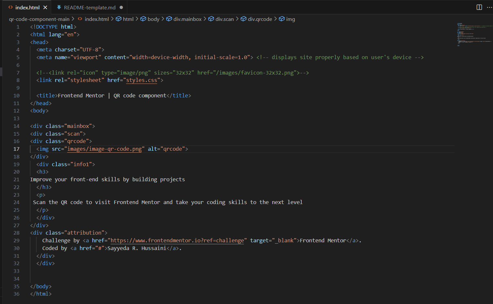

# Frontend Mentor - QR code component solution

This is a solution to the [QR code component challenge on Frontend Mentor](https://www.frontendmentor.io/challenges/qr-code-component-iux_sIO_H). Frontend Mentor challenges help you improve your coding skills by building realistic projects. 

## Table of contents

- [Overview](#overview) 
  - [Screenshot](#screenshot)
  - [Links](#links)
  - [Built with](#built-with)
  - [What I learned](#what-i-learned)
  - [Continued development](#continued-development)
  - [Useful resources](#useful-resources)
- [Author](#author)

**Note: Delete this note and update the table of contents based on what sections you keep.**

## Overview
I have used HTML and CSS to create this qr code scan card. Coding this was very easy. I saw the preview image of it and created it. 

### Screenshot

**Note: Delete this note and the paragraphs above when you add your screenshot. If you prefer not to add a screenshot, feel free to remove this entire section.**

### Links

- Solution URL: 
- Live Site URL: 

### Built with

- Semantic HTML5 markup
- CSS custom properties

**Note: These are just examples. Delete this note and replace the list above with your own choices**

### What I learned

I want to keep practicing my coding skills, and these challenges are the best way to do it.

**Note: Delete this note and the content within this section and replace with your own learnings.**

### Continued development

- Practicing HTML and CSS
- Improve Javascript
- React

**Note: Delete this note and the content within this section and replace with your own plans for continued development.**

### Useful resources

- https://www.w3schools.com/
- https://javascript.info/

**Note: Delete this note and replace the list above with resources that helped you during the challenge. These could come in handy for anyone viewing your solution or for yourself when you look back on this project in the future.**

## Author

- Sayyeda R. Hussaini
- Frontend Mentor - @srhussaini - https://www.frontendmentor.io/profile/srhussaini

**Note: Delete this note and add/remove/edit lines above based on what links you'd like to share.**
